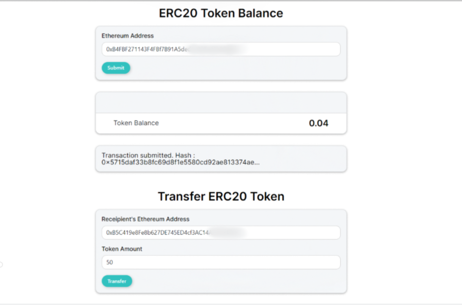

# ERC20 Transfer dApp

The ERC20 Transfer dApp is a simple web application that allows you to fetch and display token balances, as well as transfer ERC20 token. The app includes validation for Ethereum addresses to ensure the accuracy of transactions. It is designed for use on the Goreli Testnet and requires Metamask to interact with the Ethereum network.

## Features

- Fetch and display token balance
- Transfer wETH to a recipient address
- Validation for Ethereum addresses

## Tech Stack

The ERC20 Transfer App is built using the following technologies and libraries:

1. React - A popular JavaScript library for building user interfaces.
2. Reactstrap - A set of React components that provide Bootstrap 4 elements and styles.
3. Web3 - A JavaScript library for interacting with the Ethereum blockchain and smart contracts.
4. Web3-react - A library that enables seamless integration of Web3 with React applications.
5. React Hot Toast - A toast notification library for React that provides non-blocking notifications.
6. React Icons - A library that offers a collection of popular icon packs as React components.
7. Styled Components - A CSS-in-JS library that allows writing CSS styles using JavaScript.

## Prerequisites

Before using the ERC20 Transfer App, make sure you have the following:

- Metamask wallet with your Ethereum account private key
- Some wETH tokens in your wallet for testing purposes
- Access to the Goreli Testnet

## Getting Started

Follow these instructions to get started with the ERC20 Transfer App:

1. **Connect Metamask Wallet**: Launch the app and connect your Metamask wallet to interact with the app and sign transactions.

2. **Configure .env File**: Add your private key to the .env file provided in the project to enable transaction signing.

3. **Enter Contract Address**: Enter a valid contract address deployed on the Goreli Testnet to fetch the token balance.

4. **Enter Recipient Address and Amount**: Provide the recipient's Ethereum address and the amount of wETH you want to transfer.

5. **Transfer wETH**: After entering the required details, initiate the transfer. You will receive a transaction hash upon successful transfer, which you can verify on Etherscan for the Goreli Testnet.

## How to Get wETH

If you don't have wETH tokens, here are the required steps to obtain them:

1. **Obtain GoreliETH**: Get GoreliETH from any faucet available for the Goreli Testnet.

2. **Convert to wETH**: Use the Uniswap DEX at https://app.uniswap.org/ to convert your GoreliETH into wETH.

3. **Import wETH to Metamask**: Import the wETH token to your Metamask wallet using the address: 0xB4FBF271143F4FBf7B91A5ded31805e42b2208d6.

4. **Fetch Balance**: You can use the same address (0xB4FBF271143F4FBf7B91A5ded31805e42b2208d6) to fetch your wETH token balance.

Happy transferring and managing your wETH tokens with the ERC20 Transfer App! If you encounter any issues or have suggestions for improvement, feel free to open an issue on this GitHub repository. Your feedback is highly appreciated.
